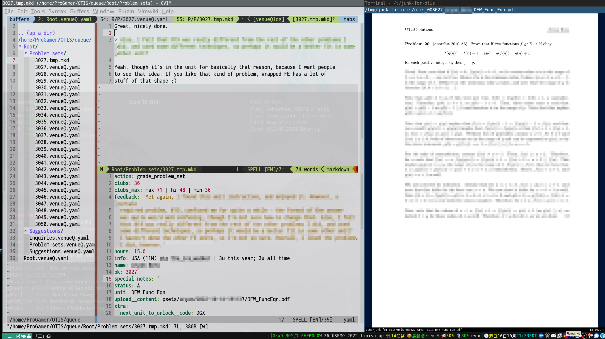

```
░▄░░░▄░█▀▀░█▀▀▄░█░▒█░█▀▀░▒█▀▀█
░░█▄█░░█▀▀░█░▒█░█░▒█░█▀▀░▒█░▒█
░░░▀░░░▀▀▀░▀░░▀░░▀▀▀░▀▀▀░░▀▀█▄
```

VenueQ is short for VIM-Menue-Queue (while not so subtly referencing AvenueQ).
It's another crappy wrapper script that I wrote in Python.

## Screenshots



## Premise

The basic premise is the following. You are, say, a teacher, and you have some
[crummy website written by obviously-not-a-programmer](https://github.com/vEnhance/otis-web)
where students are submitting their work.
This means you have a batch of tasks that you want to do for each submission,
which are all pretty straightforward:
maybe you want to read each file, email a few short comments to the student,
choose what the student should work on next, and log it into a website.
This is a lot of annoying switching between a bunch of applications to do a
bunch of tasks that you'd rather ask your TA to do for you,
but your TA's are undergraduates who are notoriously unreliable.

**venueQ** is designed to decrease the amount of friction for a power user who
is both a diehard Vim user and are also willing to write code that automates the
repetitive parts. The idea is:

- Each workflow is abstracted into a **VenueQPlate**.
  The plate has a method that will fetch a list of things to do.
- The Plate generates a bunch of **VenueQNode** objects.
  Some of the nodes are folders.
  And others are files that correspond to tasks.
  For example, maybe it's a YAML file with some data,
  plus a few blanks for you to input some comments in.
- A short Vim script ties into the popular NerdTree plugin
  which lets you browse through all these tasks.
- The unfortunate teacher deals with the tasks one by one.
  When they write the file, if certain user-defined conditions are met,
  it marks the task as done and clears it off your plate.

In short, the flow of data looks like:

```
External data ==> VenueQPlate ==> VenueQNode (edit in Vim) ==> ?
```

In many cases I imagine the plate is populated by a remote server
that is in turn modified by the user-defined `?` procedure.

## Documentation

when pigs fly
